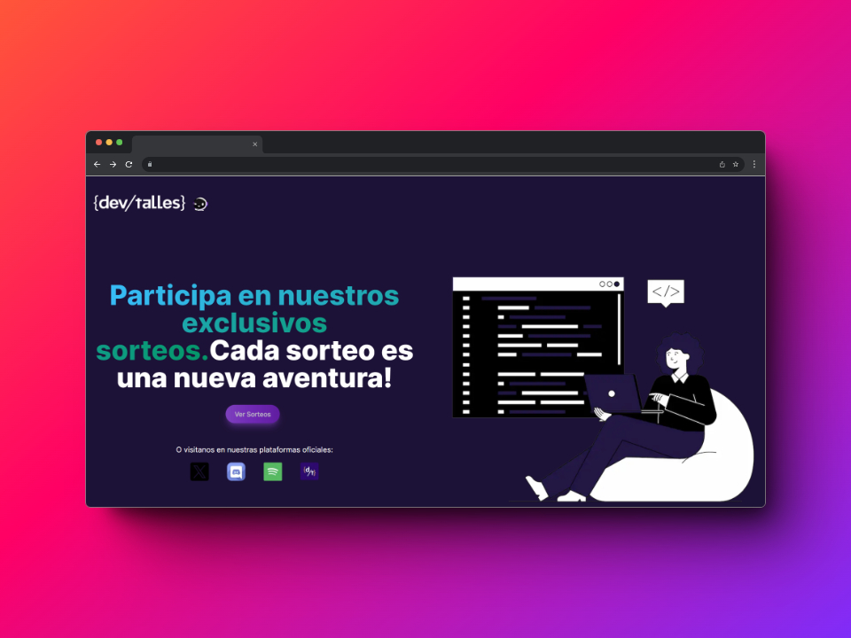

#  DevTalles CodeQuest 2024



## Table of Contents

- [Introduction](#-introduction)
- [Getting Started](#-getting-started)
- [Built With](#-built-with)
- [Demo](#-demo)
- [Contributing](#-contributing)
- [Authors](#-authors)
- [License](#-icense)

## 💻 Introduction

Welcome to the DevTalles Community Raffle App!

This powerful tool is your ticket to seamlessly organizing and executing raffles among community members at any time. Whether it's distributing prizes, fostering engagement, or simply spreading excitement, your app is ready to make it happen.

So, sit back, relax, and let the raffles begin!

This app is the deliverable for the [Code Quest 2024](https://twitter.com/DevTalles/status/1763607606289993817), a progamming challenge for the DevTalles community.

The application allows admin user to do the CRUD about raffles. Also, it allows that students can participate in different raffles if they belongs to the discord community.

## 🚀 Getting Started

You will need to have in your local machine:

- [Node.js v20.9.0](https://nodejs.org/en/).
- [Git](https://git-scm.com/).
- [Docker and Docker Compose](https://www.docker.com/)

To run the project locally, you have to:

1. Clone this project:

```bash
git clone git@github.com:luisvidev/devtalles-competition-app.git
```

3. Go to [Discord developer documentation](https://discord.com/developers/docs/intro) adn then, create a Discord application. Keep the `CLIENT_ID` and `CLIENT_SECRET` with you.
   _Note: if you need help at this point, read [this tutorial.](https://discord.com/developers/docs/getting-starte)_

4. Rename `.env.template` file for `.env` .

5. Replace all variables in the `.env` for real values. You will have to paste the Discord variables previously.

6. Start the database from a docker container. Run the following command in the root folder of the project:

```bash
docker compose up -d
```

7. Install dependencies:

```bash
npm install
```

8. Setup the database applying migrations:

```bash
npx prisma migrate dev
```

9. Run the seeder script to populate the database with dummy data:

```bash
npm run seed
```

10. Run The application

```bash
npm run dev
```

At this point, you will see your app in `localhost:3000`.

## 🛠️ Built With

Stack used for this project:

[Next.js](https://nextjs.org/) - The React framework
[Tailwind CSS](https://tailwindcss.com/) - For styling
[NextAuth.js](https://next-auth.js.org/getting-started/upgrade-v4) - For Authentication
[Prisma](https://www.prisma.io/) - As our ORM

## 🎉 Demo

## 👩‍💻 Authors

- Johana Fernández - JohanaFernandezHernandez
- Gustavo Perez - gdpp
- Kevin Rincon - KevinRinconN
- Luis Fernando Cruces - YourUsername

See also the list of [contributors](https://github.com/luisvidev/devtalles-competition-app/graphs/contributors) who participated in this project.

## 🔑 License

[MIT](https://github.com/pheralb/react-symbols/blob/main/LICENSE).
